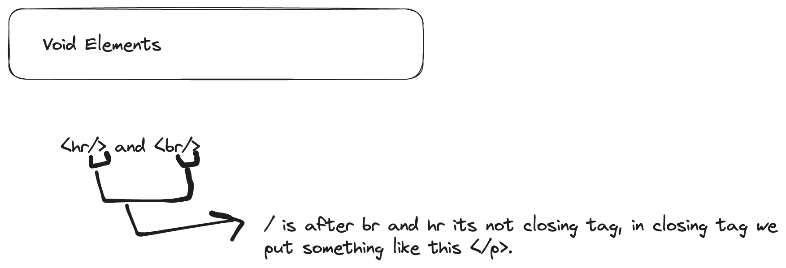

Read about internet more , The internet
1. 
   1. IP address -> Every single computer connected to internet has an ip address.
   2. IP address is unique.
   3. client->ISP(Internet Service Provider)-> DNS(Domain Name System) (Phone Book)
   4. https://www.nslookup.io/
   5. Internet is just a bunch of wires that connects up different computer.

2. How Do Websites Work?
   1. Browsers can understand just three types of things that is html, css, and javascript.
   2. try to see google in 1998.
   3. world first website-> http://info.cern.ch/hypertext/WWW/TheProject.html
3. <Tag> vs. Element

<h1>-> opening tag </h1>-> closing tag,-> this is called tags, that is h1 opening and h1 closing.
<h1>some content </h1>-> all together is called element.

h1 to h6 -> these are 6 types of heading in html.

1. https://www.lipsum.com/
2. https://www.broipsum.com/

4. Void Elements
  1. We can ignore forward slash also, we can write simply like this   or 

https://www.diffchecker.com/

https://www.rogerebert.com/

5. The List Elements
 1. Ordered and Unordered Lists

<!-- Nested list -->
1. If we have to create nested list then we have to add another order list of unordered list inside particulart list item where we want nexted list and so on..

6. HTML Attributes

https://developer.mozilla.org/en-US/docs/Web/HTML/Global_attributes
 1. we can apply global attribute to any give element.
 2. https://developer.mozilla.org/en-US/docs/Web/HTML/Element/ol

 7. The Image Element
   1. 
   2. 
   4. https://picsum.photos/
   5. Alt attribute Best used for Screen Readers.
   6. Silktide - website accessibility simulator

8. absolute path
 1. 

9. Hosting Your Website
  1. Go to github.com
  2. then Go to Create new Repository
  4. then Give name to Repository
  5. then you can choose private of public (anyone)
  6. then we will redirect to particular repository which you created.
  7. then choose add file
  8. then choose upload files
  9. then choose file which is having index.html file.
  10. important note is that file name should be index.html
